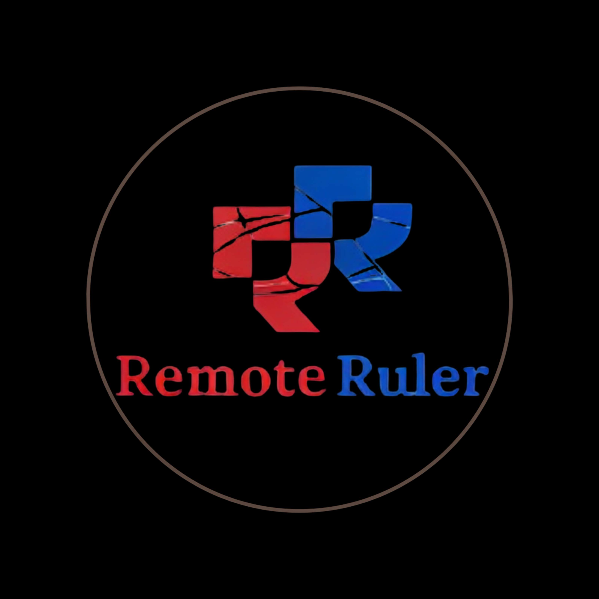

# Remote Ruler | Pro Search

> **Experience liftoff with the next-generation Search.**

Remote Ruler is a premium, privacy-focused search interface designed with a "Google Antigravity" aesthetic. It features a deep blue universe theme, an interactive floating particle system that reacts to your mouse, and a vast library of unique motivational quotes that greet you on every visit.

## Features

-   **Antigravity Physics**: A custom-built particle engine where elements float upwards and react to mouse movement with 3D parallax effects.
-   **Smart Quotes**: A database of over 300 motivational quotes that randomly refresh and never repeat until you've seen them all.
-   **Privacy First**: The pill-shaped search bar redirects securely to DuckDuckGo/Google (configurable) "Without Being Tracked".
-   **Content Protection**: The interface is "read-only" (uncopyable) to maintain the immersive experience, while keeping the search input fully functional.
-   **Responsive Design**: Mobile-friendly layout that looks stunning on any device.

## Installation / Usage

1.  Clone this repository.
2.  Open `index.html` in your web browser.
3.  Enjoy the experience!

## Technologies

-   **HTML5**
-   **CSS3** (Variables, Flexbox, Canvas)
-   **JavaScript** (ES6+, Canvas API, LocalStorage)

## Copyright

**© 2025 Remote Ruler. All rights reserved.**

This project and its original design assets are the property of Remote Ruler.
Designed by **Fahim Monayem Sopnil**.
